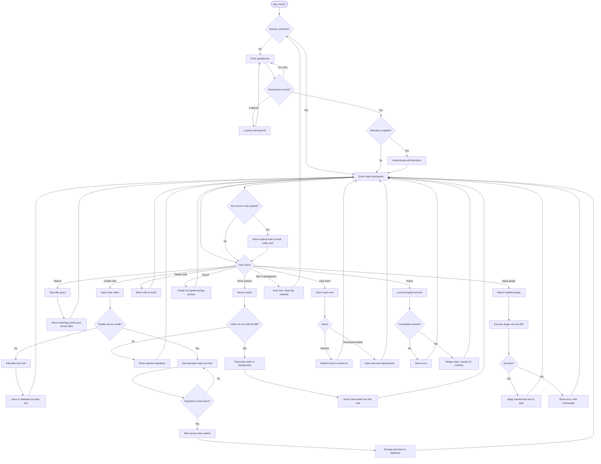

# AstraNotes Activity Diagram

```mermaid
flowchart TD

    Start([App Launch]) --> CheckSession{Session unlocked?}

    CheckSession -->|No| EnterPassphrase[Enter passphrase]
    CheckSession -->|Yes| ShowNotes

    EnterPassphrase --> ValidPass{Passphrase correct?}
    ValidPass -->|No, retry| EnterPassphrase
    ValidPass -->|5 failures| Lockout[Lockout with backoff]
    Lockout --> EnterPassphrase
    ValidPass -->|Yes| BiometricAvail{Biometric enabled?}
    BiometricAvail -->|Yes| BiometricAuth[Authenticate with biometric]
    BiometricAvail -->|No| ShowNotes[Show notes workspace]
    BiometricAuth --> ShowNotes

    ShowNotes --> UserAction{User action}

    %% Normal note flow
    UserAction -->|Create note| CreateNote[Open note editor]
    CreateNote --> SecureToggle{Enable secure mode?}
    SecureToggle -->|No| EditNormal[Edit plain text note]
    EditNormal --> SaveNormal[Save to database as plain text]
    SaveNormal --> ShowNotes

    SecureToggle -->|Yes| SetExpiry[Set expiration date and time]
    SetExpiry --> ExpiryValid{Expiration in the future?}
    ExpiryValid -->|No| SetExpiry
    ExpiryValid -->|Yes| EditSecure[Edit secure note content]
    EditSecure --> EncryptSave[Encrypt and save to database]
    EncryptSave --> ShowNotes

    %% Search flow
    UserAction -->|Search| EnterQuery[Type title query]
    EnterQuery --> SearchResults[Show matching normal and secure titles]
    SearchResults --> ShowNotes

    %% Voice capture flow
    UserAction -->|Voice capture| RecordAudio[Record audio]
    RecordAudio --> SizeCheck{Under 10 min and 50 MB?}
    SizeCheck -->|No| RejectAudio[Show rejection feedback]
    RejectAudio --> ShowNotes
    SizeCheck -->|Yes| Transcribe[Transcribe audio in background]
    Transcribe --> InsertText[Insert transcribed text into note]
    InsertText --> ShowNotes

    %% Plugin flow
    UserAction -->|Apply plugin| SelectPlugin[Select installed plugin]
    SelectPlugin --> RunPlugin[Execute plugin via host API]
    RunPlugin --> PluginOk{Success?}
    PluginOk -->|Yes| ApplyResult[Apply transformed text to note]
    PluginOk -->|No| PluginError[Show error, note unchanged]
    ApplyResult --> ShowNotes
    PluginError --> ShowNotes

    %% Trash flow
    UserAction -->|Delete note| MoveToTrash[Move note to trash]
    MoveToTrash --> ShowNotes
    UserAction -->|View trash| TrashView[Open trash view]
    TrashView --> TrashAction{Action}
    TrashAction -->|Restore| RestoreNote[Restore note to active list]
    TrashAction -->|Permanent delete| WipeNote[Wipe note and attachments]
    RestoreNote --> ShowNotes
    WipeNote --> ShowNotes

    %% Export/Import
    UserAction -->|Export| CreateArchive[Create encrypted backup archive]
    CreateArchive --> ShowNotes
    UserAction -->|Import| LoadArchive[Load encrypted archive]
    LoadArchive --> ImportOk{Compatible archive?}
    ImportOk -->|No| ImportError[Show error]
    ImportOk -->|Yes| MergeNotes[Merge notes, resolve ID conflicts]
    MergeNotes --> ShowNotes
    ImportError --> ShowNotes

    %% Auto-lock
    UserAction -->|Idle or background| AutoLock[Auto-lock, clear key material]
    AutoLock --> CheckSession

    %% System expiration
    ShowNotes --> ExpiryCheck{Any secure note expired?}
    ExpiryCheck -->|Yes| ExpireNote[Move expired note to trash, notify user]
    ExpiryCheck -->|No| UserAction
    ExpireNote --> UserAction
```
