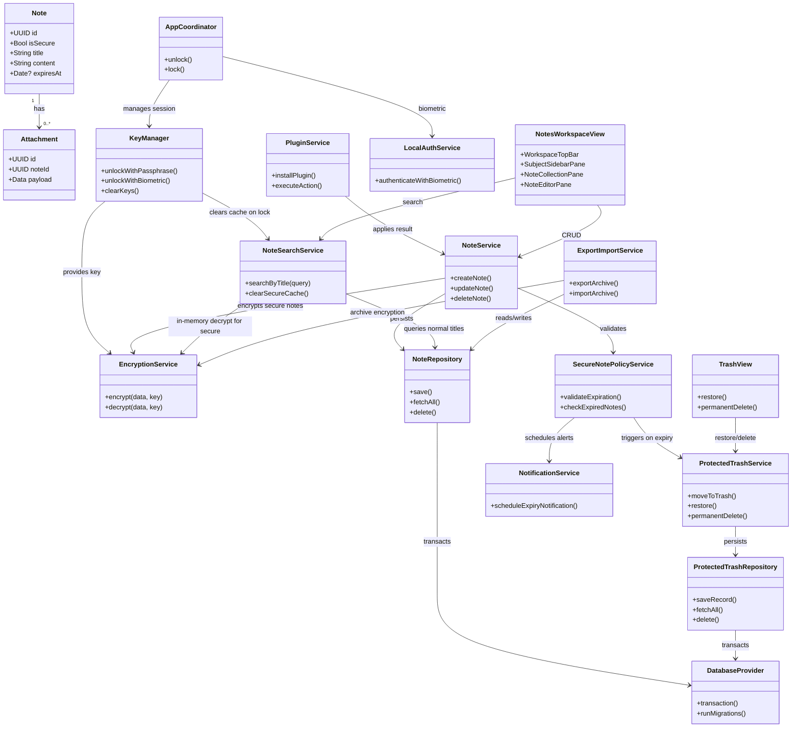

# AstraNotes Class Diagram

```mermaid
classDiagram

    %% ── Models ──────────────────────────────────
    class Note {
        +UUID id
        +Bool isSecure
        +String title
        +String content
        +Date? expiresAt
    }

    class Attachment {
        +UUID id
        +UUID noteId
        +Data payload
    }

    %% ── Core Services ───────────────────────────
    class AppCoordinator {
        +unlock()
        +lock()
    }

    class KeyManager {
        +unlockWithPassphrase()
        +unlockWithBiometric()
        +clearKeys()
    }

    class NoteService {
        +createNote()
        +updateNote()
        +deleteNote()
    }

    class EncryptionService {
        +encrypt(data, key)
        +decrypt(data, key)
    }

    class SecureNotePolicyService {
        +validateExpiration()
        +checkExpiredNotes()
    }

    class ProtectedTrashService {
        +moveToTrash()
        +restore()
        +permanentDelete()
    }

    class NoteSearchService {
        +searchByTitle(query)
        +clearSecureCache()
    }

    class PluginService {
        +installPlugin()
        +executeAction()
    }

    class ExportImportService {
        +exportArchive()
        +importArchive()
    }

    %% ── Persistence ─────────────────────────────
    class DatabaseProvider {
        +transaction()
        +runMigrations()
    }

    class NoteRepository {
        +save()
        +fetchAll()
        +delete()
    }

    class ProtectedTrashRepository {
        +saveRecord()
        +fetchAll()
        +delete()
    }

    %% ── Platform ────────────────────────────────
    class LocalAuthService {
        +authenticateWithBiometric()
    }

    class NotificationService {
        +scheduleExpiryNotification()
    }

    %% ── UI ──────────────────────────────────────
    class NotesWorkspaceView {
        +WorkspaceTopBar
        +SubjectSidebarPane
        +NoteCollectionPane
        +NoteEditorPane
    }

    class TrashView {
        +restore()
        +permanentDelete()
    }

    %% ── Relationships ───────────────────────────

    Note "1" --> "0..*" Attachment : has

    AppCoordinator --> KeyManager : manages session
    AppCoordinator --> LocalAuthService : biometric

    KeyManager --> EncryptionService : provides key
    KeyManager --> NoteSearchService : clears cache on lock

    NoteService --> NoteRepository : persists
    NoteService --> EncryptionService : encrypts secure notes
    NoteService --> SecureNotePolicyService : validates

    SecureNotePolicyService --> ProtectedTrashService : triggers on expiry
    SecureNotePolicyService --> NotificationService : schedules alerts

    ProtectedTrashService --> ProtectedTrashRepository : persists

    NoteSearchService --> NoteRepository : queries normal titles
    NoteSearchService --> EncryptionService : in-memory decrypt for secure

    PluginService --> NoteService : applies result
    ExportImportService --> NoteRepository : reads/writes
    ExportImportService --> EncryptionService : archive encryption

    NoteRepository --> DatabaseProvider : transacts
    ProtectedTrashRepository --> DatabaseProvider : transacts

    NotesWorkspaceView --> NoteService : CRUD
    NotesWorkspaceView --> NoteSearchService : search
    TrashView --> ProtectedTrashService : restore/delete
```
