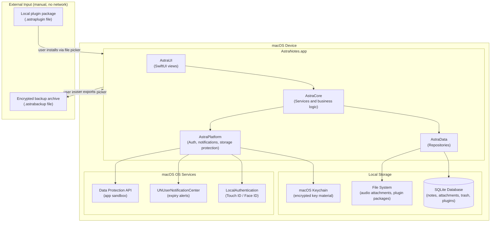

# AstraNotes Deployment Diagram

```mermaid
flowchart TD

    subgraph macDevice["macOS Device"]

        subgraph astraApp["AstraNotes.app"]
            uiLayer["AstraUI\n(SwiftUI views)"]
            coreLayer["AstraCore\n(Services and business logic)"]
            dataLayer["AstraData\n(Repositories)"]
            platformLayer["AstraPlatform\n(Auth, notifications, storage protection)"]
        end

        subgraph storage["Local Storage"]
            sqliteDB[("SQLite Database\n(notes, attachments, trash, plugins)")]
            fileStorage["File System\n(audio attachments, plugin packages)"]
            keychain["macOS Keychain\n(encrypted key material)"]
        end

        subgraph os["macOS OS Services"]
            localAuth["LocalAuthentication\n(Touch ID / Face ID)"]
            notificationCenter["UNUserNotificationCenter\n(expiry alerts)"]
            fileProtection["Data Protection API\n(app sandbox)"]
        end

    end

    subgraph externalInput["External Input (manual, no network)"]
        backupFile["Encrypted backup archive\n(.astrabackup file)"]
        pluginPackage["Local plugin package\n(.astraplugin file)"]
    end

    %% Internal layer connections
    uiLayer --> coreLayer
    coreLayer --> dataLayer
    coreLayer --> platformLayer
    dataLayer --> sqliteDB
    dataLayer --> fileStorage
    platformLayer --> keychain
    platformLayer --> localAuth
    platformLayer --> notificationCenter
    platformLayer --> fileProtection

    %% External inputs
    backupFile -->|user imports via file picker| astraApp
    pluginPackage -->|user installs via file picker| astraApp

    %% Export output
    astraApp -->|user exports| backupFile
```
