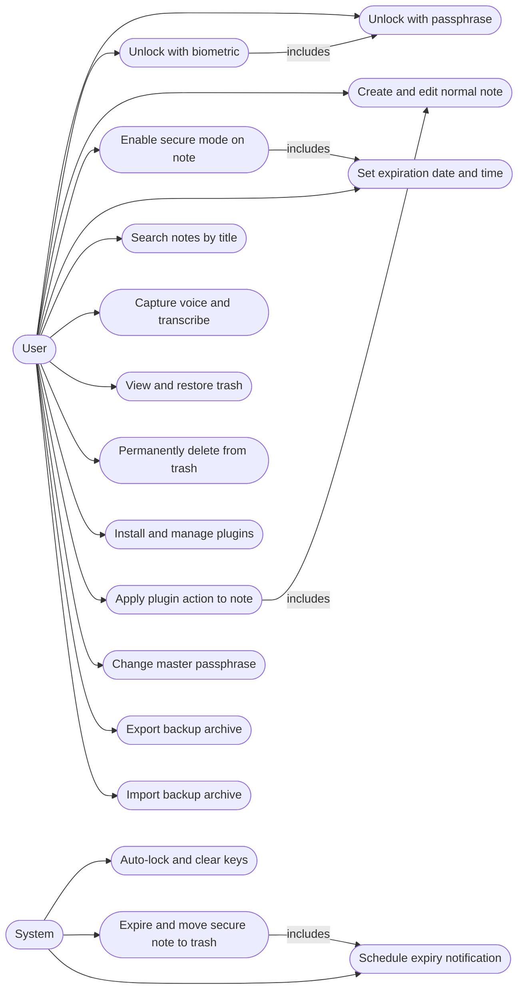

# AstraNotes Use Case Diagram

```mermaid
flowchart LR

    %% Actors
    User(["User"])
    System(["System"])

    %% Use Cases
    UC1([Unlock with passphrase])
    UC2([Unlock with biometric])
    UC3([Auto-lock and clear keys])
    UC4([Create and edit normal note])
    UC5([Enable secure mode on note])
    UC6([Set expiration date and time])
    UC7([Search notes by title])
    UC8([Capture voice and transcribe])
    UC9([View and restore trash])
    UC10([Permanently delete from trash])
    UC11([Install and manage plugins])
    UC12([Apply plugin action to note])
    UC13([Change master passphrase])
    UC14([Export backup archive])
    UC15([Import backup archive])
    UC16([Expire and move secure note to trash])
    UC17([Schedule expiry notification])

    %% User-initiated use cases
    User --> UC1
    User --> UC2
    User --> UC4
    User --> UC5
    User --> UC6
    User --> UC7
    User --> UC8
    User --> UC9
    User --> UC10
    User --> UC11
    User --> UC12
    User --> UC13
    User --> UC14
    User --> UC15

    %% System-triggered use cases
    System --> UC3
    System --> UC16
    System --> UC17

    %% Include relationships
    UC2 -->|includes| UC1
    UC5 -->|includes| UC6
    UC12 -->|includes| UC4
    UC16 -->|includes| UC17
```
